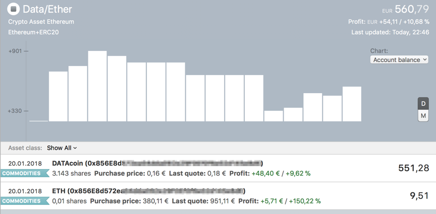

# MoneyMoney-Extension for Ethereum/ERC20

Inofficial [MoneyMoney](https://moneymoney-app.com) extension to query Ethereum addresses for ETH and [ERC20](https://en.wikipedia.org/wiki/ERC20)-tokens (like EOS, OMG, DataCoin,...)

## Installation

* Download the extension from MoneyMoney's [extension page](https://moneymoney-app.com/extensions/)
* Move the downloaded Ethereum_Tokens.lua to your MoneyMoney-Extension-Folder *(don't know where that is? Go to "Help" Menu in MoneyMoney and click "Show database in finder", go to folder "extensions")*

The new extension is available without restarting MoneyMoney.

## Account Setup

Add a new account (Other -> Ethereum+ERC20)

* Enter your public Ethereum address as username (like 0x856E8d572ea04dda092e29...)
* Enter "123" as password (or anything else, doesn't matter)

